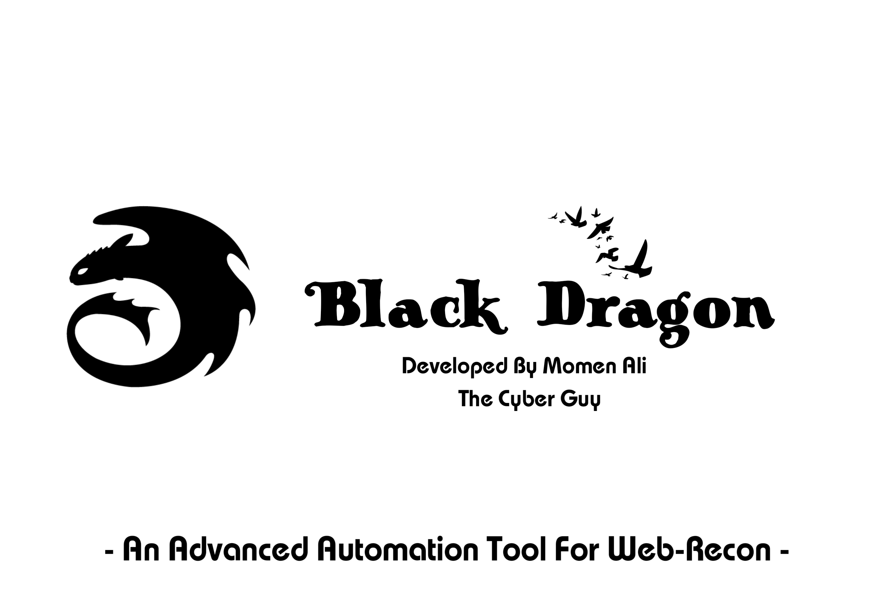

# Black-Dragon
An Adavnced Automation Tool For Web-Recon Developed For Linux Systems

## What Is Black Dragon ?

It's A Tool To Automate The Web Reconnaissance Proccess, Which Make It Easier To Gather Informations About Your Target. This Tool Will Help You In Your Bug Hunting Or Web Penetration Testing Operation Because It Not Only Gather Informations About The Target, But Also It Arranges All These Information In A Structed Way Which Makes You Analyse The Data In A Good Way.

This Tool Works In Linux Systems, Specially In Debian & Debian Based Systems Like:

1. Kali Linux
2. Parrot OS
3. Ubuntu
4. Debian
5. Back Box

And Other Debian Based Linux Distro's 
